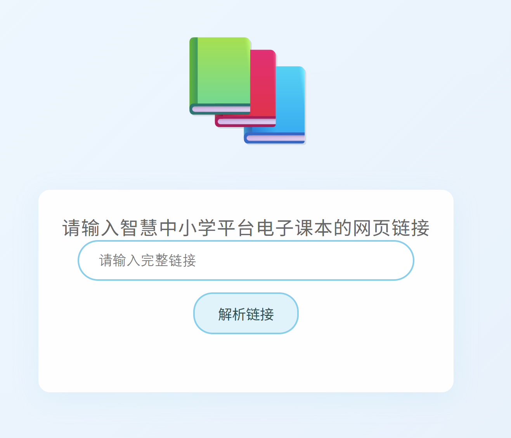

# Chinese-ebook-downloader
下载电子课本的轻量化网页小工具

## 项目简介

这是一个基于网页的电子课本下载工具，专为从智慧中小学平台获取无水印电子课本而设计。用户只需输入电子课本的网页链接，工具即可自动解析并提供PDF下载链接。



## 安装说明
点击code，下载zip，点击HTML文件即可。

## 功能特点

- 简洁直观的用户界面
- 自动解析智慧中小学平台的电子课本链接
- 一键下载无水印PDF电子课本
- 实时错误提示


## 使用说明

1. 访问智慧中小学平台（https://basic.smartedu.cn）
2. 找到需要下载的电子课本页面，复制浏览器地址栏中的完整链接
3. 在本工具页面粘贴复制的链接
4. 点击"解析链接"按钮
5. 系统将自动在新标签页中打开PDF文件（或触发下载）

## 技术实现

核心功能通过JavaScript实现，主要步骤包括：
1. 使用正则表达式匹配URL中的`contentId`参数
2. 根据平台资源路径规则生成PDF下载链接
3. 通过`window.open()`在新窗口打开PDF

```javascript
function processLink() {
    const url = document.getElementById('textbookUrl').value;
    const match = url.match(/contentId=([^&]+)/);
    
    if (match && match[1]) {
        const contentId = match[1];
        const pdfUrl = `https://r1-ndr.ykt.cbern.com.cn/edu_product/esp/assets_document/${contentId}.pkg/pdf.pdf`;
        window.open(pdfUrl, '_blank');
    } else {
        // 显示错误信息
    }
}
```

## 关于style的说明

本工具style内容为从一个网页整体项目中取出，没有简略，故有部分样式程序中没调用。

## 免责声明

本工具仅用于个人学习交流目的，下载的电子课本版权归原出版社所有。请勿将本工具用于商业用途或大规模下载。使用者应尊重版权，在下载后24小时内删除文件，并购买正版教材用于日常学习。

## 常见问题

**Q：为什么提示"无效链接"？**  
A：请确保输入的链接是完整的智慧中小学平台电子课本链接，且包含"contentId"参数。


**Q：支持下载所有年级的课本吗？**  
A：支持智慧中小学平台上的所有电子课本，包括小学、初中和高中各学科教材。


## 使用提示

1. 请确保输入的链接是直接从浏览器地址栏复制的完整URL
2. 如果下载失败，请检查网络连接或尝试重新解析
3. 建议使用现代浏览器（Chrome、Firefox、Edge等）访问本工具

